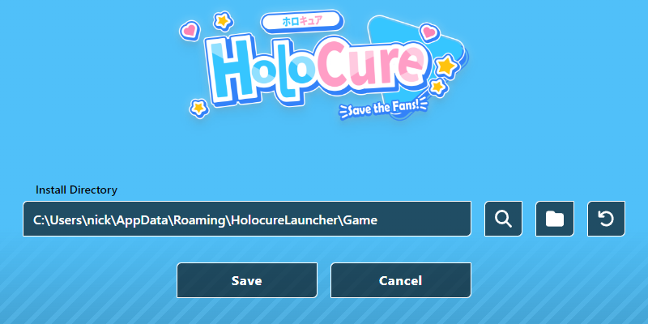
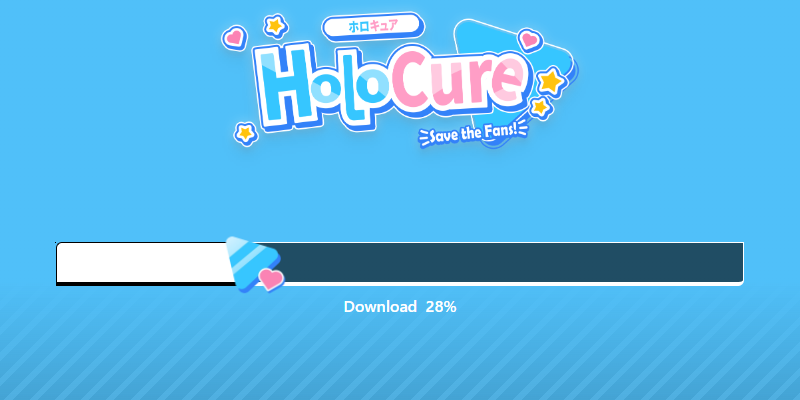

# HoloCure Launcher

> **Warning**
> 
> With [the announcement of HoloCure being released on Steam](https://twitter.com/HoloCureGame/status/1656778815102914560) I will no longer be supporting this project.
> It wasn't very long lived, but it was a fun little toy.

HoloCure [took down their launcher](https://twitter.com/HoloCureGame/status/1652020979051405312) for unstated reasons. [Key Yu stated that it wasn't up to them](https://www.reddit.com/r/holocure/comments/1326pzc/comment/ji3mbaf/).

This is a 3rd party launcher that allows you to keep your game updated just like the old one.

I have no involvement with the HoloCure team. So if you, the reader, are the party that caused the launcher to go down, go after me not them. Thanks :)

## Features

~~It's a game launcher, it launches the game.~~

- Downloading of game files
- Updating of game files
- Playing of game
- Cross platform (Windows, Mac, Linux)
  - The game is still Windows only, but there's ways around that. A feature that lets you configure how it's launched is planned, which will allow the game to run on Linux and Mac.
- Configurable game directory

## Images

  
